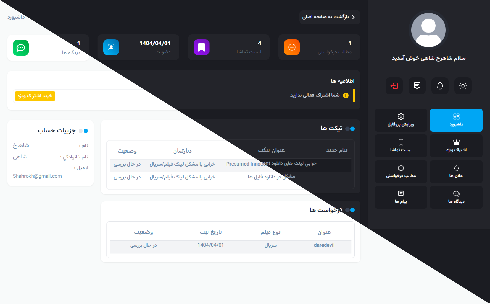

## ⭐️ Project Demo Link : [Movie Website](https://moviewebsite.liara.run/)

# 🎬 Movie & TV Series Web Application

This is a full-featured movie and TV series web application built with **React.js** and **Tailwind CSS**, allowing users to browse, filter, and interact with movie content. The platform also includes advanced user features such as ticketing, comments, notifications, and a powerful admin panel.

## 🚀 Features

<h3 align="center">Picture Of User Panel</h3>

- ✅ Fully responsive, RTL support for Persian
- 🔍 Smart filter system (by genre, score, language, year, country)
- 🗂 Weekly releases & scheduling system for episodes for both movies and series
- 💬 Nested comment system with admin approval
- 📩 Ticketing system with live support messaging
- 🔔 User notifications (read/unread logic)
- 👥 User authentication and ban/vip subscription management
- 📤 Share & report boxes for each movie
- 📊 Admin panel to manage users, content, tickets, and comments
- 🌐 requesting system
- 💡 Accessible design with dark mode

## 🧱 Tech Stack

| Technology        | Description                                      |
|-------------------|--------------------------------------------------|
| **React.js**       | Front-end framework                              |
| **React Router DOM** | Routing and page navigation                     |
| **Tailwind CSS**   | Styling system with RTL and dark mode support    |
| **Yup**            | Schema validation for forms                      |
| **React Hook Form**| Lightweight form state management                |
| **Axios**          | HTTP client for API calls                        |
| **React Hot Toast**| Toast notifications system                       |
| **React Icons**    | Icon system with clean vector icons              |
| **Day.js**         | Date handling, with Jalali calendar support      |
| **Supabase**       | Backend-as-a-Service (Auth, Database)  |